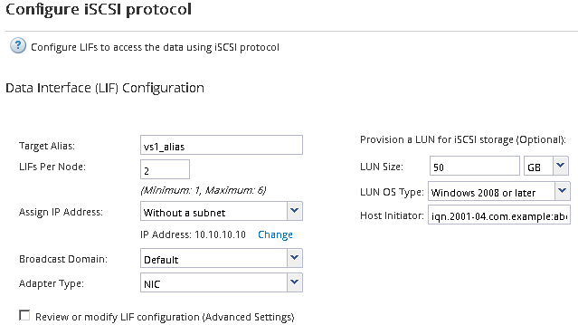

= Créer un nouveau SVM
:allow-uri-read: 
:icons: font
:imagesdir: ../media/

[role="lead"]
La machine virtuelle de stockage (SVM) fournit la cible iSCSI par l'intermédiaire de laquelle un hôte accède aux LUN. Lorsque vous créez le SVM, vous créez également des interfaces logiques (LIF), ainsi que la LUN et son volume contenant. On peut créer un SVM afin de séparer les fonctions de données et d'administration d'un utilisateur de celles des autres utilisateurs d'un cluster.

.Avant de commencer
* Vous devez disposer d'un nombre suffisant d'adresses réseau disponibles pour créer deux LIF pour chaque nœud.

.Description de la tâche
Les LUN sont mappées sur un sous-ensemble d'initiateurs du groupe initiateur pour limiter le nombre de chemins d'accès de l'hôte à la LUN.

* Par défaut, ONTAP utilise le mappage de LUN sélectif (SLM) pour rendre la LUN accessible uniquement via des chemins sur le nœud propriétaire de la LUN et son partenaire HA.
* Vous devez toujours configurer toutes les LIF iSCSI sur chaque nœud pour la mobilité de la LUN si celle-ci est déplacée vers un autre nœud du cluster.
* Lors du déplacement d'un volume ou d'une LUN, vous devez modifier la liste SLM-reporting-nodes avant le déplacement.

.Étapes
. Accédez à la fenêtre *SVM*.
. Cliquez sur *Créer*.
. Dans la fenêtre *Storage Virtual machine (SVM) Setup*, créer la SVM:
+
image::../media/svm_setup_details_page_ntfs_selected_iscsi_windows.gif[L'illustration représente la création d'un SVM avec le style de sécurité NTFS]

+
.. Spécifier un nom unique pour le SVM.
+
Le nom doit être un nom de domaine complet (FQDN) ou suivre une autre convention qui garantit des noms uniques à travers un cluster.

.. Sélectionner l'IPspace auquel la SVM appartiendra.
+
Si le cluster n'utilise pas plusieurs IPspaces, le « Doubault » est utilisé.

.. Conservez la sélection par défaut du type de volume.
+
Seuls les volumes FlexVol sont pris en charge par les protocoles SAN.

.. Sélectionnez tous les protocoles pour lesquels vous disposez de licences et que vous pouvez utiliser sur la SVM, même si vous ne souhaitez pas configurer immédiatement tous les protocoles.
+
Si vous sélectionnez NFS et CIFS lorsque vous créez le SVM, ces deux protocoles peuvent partager les mêmes LIF. L'ajout ultérieur de ces protocoles ne leur permet pas de partager les LIF.

+
Si CIFS est l'un des protocoles que vous avez sélectionnés, le style de sécurité est défini sur NTFS. Sinon, le style de sécurité est défini sur UNIX.

.. Conservez le paramètre de langue par défaut C.UTF-8.
.. Sélectionner l'agrégat racine souhaité pour contenir le volume root du SVM
+
L'agrégat pour le volume de données est sélectionné séparément.

.. Cliquez sur *Envoyer et continuer*.

+
Le SVM est créé, mais les protocoles ne sont pas encore configurés.

. Si la page *Configure CIFS/NFS Protocol* s'affiche parce que vous avez activé CIFS ou NFS, cliquez sur *Skip*, puis configurez CIFS ou NFS ultérieurement.
. Configurez le service iSCSI et créez les LIF, ainsi que le LUN et le volume contenant le fichier à partir de la page *configurer le protocole iSCSI* :
+
.. *Facultatif:* Entrez un nom d'alias cible.
.. Attribuez une adresse IP aux LIF en utilisant un sous-réseau ou sans sous-réseau.
.. Entrez `*2*` Dans le champ *LIFs par nœud*.
+
Chaque nœud requiert deux LIF afin d'assurer la disponibilité et la mobilité des données.

.. Dans la zone *provisioning d'une LUN pour le stockage iSCSI*, entrez la taille de LUN, le type d'hôte et le nom d'initiateur iSCSI de l'hôte.
.. Cliquez sur *Envoyer et continuer*.

+

. Si la page *configurer le protocole FC/FCoE* s'affiche parce que vous avez activé FC, cliquez sur *Ignorer*, puis configurez le protocole FC ultérieurement.
. Lorsque *SVM Administration* apparaît, configurer ou reporter la configuration d'un administrateur distinct pour ce SVM :
+
** Cliquez sur *Ignorer* et configurez un administrateur plus tard si vous le souhaitez.
** Entrez les informations requises, puis cliquez sur *Envoyer et continuer*.

. Consultez la page *Résumé*, enregistrez les informations sur le LIF, puis cliquez sur *OK*.

