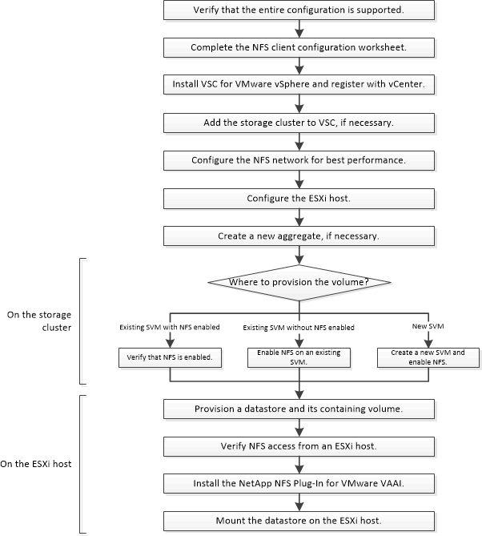

= Configuration du client NFS pour le workflow ESXi
:allow-uri-read: 
:icons: font
:imagesdir: ../media/

[role="lead"]
Lorsque vous mettez du stockage à la disposition d'un hôte ESXi via NFS, vous provisionnez un volume sur l'utilisation de, puis vous connectez à l'exportation NFS depuis l'hôte ESXi.

