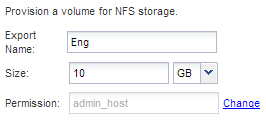

= Ajoutez un accès NFS à un SVM existant
:allow-uri-read: 
:icons: font
:imagesdir: ../media/

[role="lead"]
L'ajout d'un accès NFS à un SVM existant implique la création d'une LIF de données, éventuellement la configuration de NIS, le provisionnement d'un volume, l'exportation du volume et la configuration de l'export policy.

.Avant de commencer
* Vous devez connaître les composants réseau suivants que la SVM utilisera :
+
** Le nœud et le port spécifique sur ce nœud où sera créée l'interface logique de données (LIF)
** Le sous-réseau à partir duquel l'adresse IP de la LIF de données sera provisionnée, ou éventuellement l'adresse IP spécifique que vous souhaitez attribuer à la LIF de données

* Tout pare-feu externe doit être configuré de manière appropriée pour permettre l'accès aux services réseau.
* Le protocole NFS doit être autorisé sur la SVM.

Pour plus d'informations, reportez-vous à la section link:https://docs.netapp.com/us-en/ontap/networking/index.html["Documentation de gestion du réseau"^].

.Étapes
. Naviguer sur la zone où vous pouvez configurer les protocoles du SVM :
+
.. Sélectionnez le SVM que vous souhaitez configurer.
.. Dans le volet *Détails*, en regard de *protocoles*, cliquez sur *NFS*.
+
image::../media/svm_add_protocol_nfs_nfs.gif[Cette image est expliquée par le texte qui l'entoure.]

. Dans la boîte de dialogue *Configure NFS Protocol*, créez une LIF de données.
+
.. Attribuez automatiquement une adresse IP à la LIF à partir d'un sous-réseau que vous spécifiez ou saisissez manuellement l'adresse.
.. Cliquez sur *Browse* et sélectionnez un nœud et un port qui seront associés à la LIF.
+
image::../media/svm_setup_cifs_nfs_page_lif_multi_nas_nfs.gif[Ce graphique est décrit par le texte environnant.]

. Si votre site utilise NIS pour les services de noms ou le mappage de noms, spécifiez le domaine et les adresses IP des serveurs NIS et sélectionnez les types de base de données pour lesquels vous souhaitez ajouter la source de service de noms NIS.
+
image::../media/svm_setup_cifs_nfs_page_nis_area_nfs.gif[Ce graphique est expliqué par le texte environnant.]

+
Si les services NIS ne sont pas disponibles, ne tentez pas de les configurer. Des services NIS mal configurés peuvent entraîner des problèmes d'accès au datastore.

. Créez et exportez un volume pour un accès NFS :
+
.. Pour *Nom d'exportation*, tapez un nom qui sera à la fois le nom d'exportation et le début du nom du volume.
.. Spécifiez la taille du volume qui contiendra les fichiers.
+

+
Il n'est pas nécessaire de préciser l'agrégat du volume, car il est automatiquement situé sur l'agrégat disposant de l'espace le plus disponible.

.. Dans le champ *permission*, cliquez sur *Modifier* et spécifiez une règle d'exportation qui donne à NFSv3 l'accès à un hôte d'administration UNIX, y compris l'accès Superuser.
+
image::../media/export_rule_for_admin_manual_nfs_nfs.gif[Cette image est expliquée par le texte qui l'entoure.]

+
Vous pouvez créer un volume de 10 Go nommé Eng, l'exporter en anglais et ajouter une règle qui donne au client « admin_host » un accès complet à l'exportation, y compris l'accès Superuser.

. Cliquez sur *Envoyer et fermer*, puis sur *OK*.

