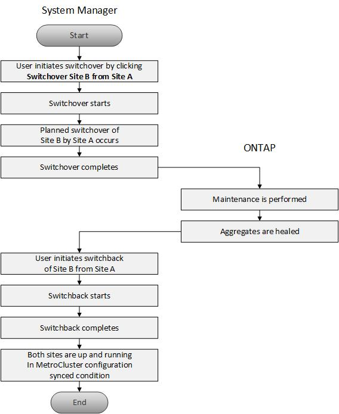

= À propos du basculement et du rétablissement MetroCluster
:allow-uri-read: 
:icons: font
:imagesdir: ../media/

[role="lead"]
Depuis ONTAP System Manager 9.6, vous pouvez utiliser les opérations de basculement et de rétablissement MetroCluster après un incident qui rend tous les nœuds du cluster source inaccessibles et hors tension. Vous pouvez également utiliser le flux de basculement pour un basculement négocié (planifié) dans des cas tels que le test de reprise après incident ou la mise hors ligne d'un site pour des opérations de maintenance.

== À propos du basculement et du rétablissement MetroCluster

Depuis System Manager 9.6, vous pouvez utiliser les opérations de basculement et de rétablissement de MetroCluster afin de permettre à un site de cluster d'effectuer les tâches décrites sur un autre site de cluster. Ainsi, il est possible de simplifier la maintenance et la reprise après incident.

Une opération de basculement permet à un cluster (site A) de reprendre les tâches qu'un autre cluster (site B) effectue généralement. Après le basculement, le cluster pris en charge (site B) peut être arrêté pour les opérations de maintenance et de réparation. Une fois la maintenance terminée, le site B peut se lancer et les tâches de rétablissement sont effectuées, puis vous pouvez lancer une opération de rétablissement qui permet au cluster réparé (site B) de reprendre les tâches habituellement exécutées.

System Manager prend en charge deux types d'opérations de basculement selon l'état du site de cluster distant :

* Un basculement négocié (planifié) : vous initiez cette opération lorsque vous devez effectuer une maintenance planifiée sur un cluster ou tester vos procédures de reprise sur incident.
* Un basculement non planifié : cette opération démarre lorsqu'un incident s'est produit sur un cluster (site B) et vous souhaitez qu'un autre site ou un autre cluster (site A) gère les tâches du cluster affectées par l'incident (site B) pendant les réparations et la maintenance.

Vous effectuez les mêmes étapes dans System Manager pour les deux opérations de basculement. Lorsque vous effectuez un basculement, System Manager détermine si l'opération est possible et aligne la charge de travail en conséquence.

== Workflow de basculement et de rétablissement MetroCluster

Le processus global de basculement et de rétablissement comprend les trois phases suivantes :

. *Basculement* : le processus de basculement vous permet de transférer le contrôle du stockage et de l'accès client d'un site de cluster source (site B) vers un autre site de cluster (site A). Cette opération permet d'assurer la continuité de l'activité lors des tests et de la maintenance. De plus, ce processus permet également d'effectuer une restauration après une défaillance sur un site. Dans le cadre des tests de reprise après incident ou de la maintenance planifiée de site, vous pouvez effectuer un basculement MetroCluster pour transférer le contrôle vers un site de reprise après incident (site A). Avant de lancer le processus, au moins un des nœuds sur site survivants doit être opérationnel avant d'effectuer le basculement. Si une opération de basculement avait déjà échoué sur certains nœuds du site de reprise sur incident, une opération peut être relancée sur tous ces nœuds.
. *Opérations du site B* : une fois le basculement terminé, System Manager termine le processus de correction pour la configuration IP de MetroCluster. La fonctionnalité de correction est un événement planifié qui vous offre une maîtrise totale de chaque étape afin de réduire les interruptions. La fonctionnalité de rétablissement s'effectue en deux phases sur les composants de stockage et de contrôleur afin de préparer les nœuds sur le site réparé pour la mise en place du processus de rétablissement. Au cours de la première phase, le processus heals les agrégats en resynchronisant les plexes en miroir, puis en hisant les agrégats racine en les replaçant sur le site de reprise sur incident.
+
Lors de la deuxième phase, le site est prêt pour le processus de rétablissement.

. *Switchback* : après la maintenance et les réparations effectuées sur le site B, vous lancez l'opération de rétablissement pour reprendre le contrôle du stockage et de l'accès du client du site A au site B. Pour un rétablissement réussi, les conditions suivantes doivent être réunies :
+
** Les nœuds de base et les tiroirs de stockage doivent être mis sous tension et accessibles par les nœuds du site A.
** Pour que vous puissiez lancer l'opération de rétablissement, System Manager doit avoir réussi la phase de rétablissement.
** Tous les agrégats du site A doivent être en miroir et ne peuvent pas être en état dégradé ou resynchronisé.
** Toutes les modifications de la configuration précédente doivent être effectuées avant d'effectuer une opération de rétablissement. Cela empêche ces modifications de rivaliser avec l'opération de basculement ou de rétablissement négociée.

== Organigramme du workflow de basculement et de rétablissement MetroCluster

L'organigramme suivant illustre les phases et les processus qui se produisent lors de l'exécution des opérations de basculement et de rétablissement.

