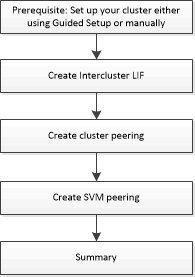

= Configuration du peering avec System Manager - ONTAP 9.7 et versions antérieures
:allow-uri-read: 
:icons: font
:imagesdir: ../media/

[role="lead"]
Vous pouvez utiliser ONTAP System Manager Classic (disponible dans ONTAP 9.7 et versions antérieures) pour configurer le peering. La configuration du peering implique la création d'interfaces logiques (LIF) intercluster sur chaque nœud, la création de ce type de peering de cluster et la création de celui-ci.

== [[prérequis-peering, conditions préalables pour le peering de cluster]] prérequis pour le peering de cluster

Avant de configurer le peering de cluster, vous devez vérifier que la connectivité, le port, l'adresse IP, le sous-réseau, le pare-feu, et les exigences de nommage des clusters sont respectées.

=== Les besoins en connectivité

Chaque LIF intercluster du cluster local doit pouvoir communiquer avec chaque LIF intercluster sur le cluster distant.

Bien qu'il ne soit pas nécessaire, il est généralement plus simple de configurer les adresses IP utilisées pour les LIF intercluster dans le même sous-réseau. Les adresses IP peuvent résider dans le même sous-réseau que les LIF de données ou dans un autre sous-réseau. Le sous-réseau utilisé dans chaque cluster doit respecter les exigences suivantes :

* Le sous-réseau doit appartenir au broadcast domain qui contient les ports utilisés pour la communication intercluster.

Les LIF intercluster peuvent disposer d'une adresse IPv4 ou IPv6.

[NOTE]
====
ONTAP 9 vous permet de migrer vos réseaux de peering d'IPv4 vers IPv6 en autorisant, éventuellement, la présence simultanée des deux protocoles sur les LIF intercluster. Dans les versions précédentes, toutes les relations intercluster pour un cluster entier étaient au format IPv4 ou IPv6. Cela signifiait que le changement de protocole était potentiellement source de perturbation.

====

=== Configuration requise pour les ports

Vous pouvez utiliser des ports dédiés pour la communication intercluster ou partager les ports utilisés par le réseau de données. Les ports doivent répondre aux exigences suivantes :

* Tous les ports utilisés pour communiquer avec un cluster distant donné doivent se trouver dans le même IPspace.
+
Vous pouvez utiliser plusieurs IPspaces pour gérer plusieurs clusters dans un même cluster. Une connectivité à maillage complet par paire est requise uniquement au sein d'un IPspace.

* Le broadcast domain utilisé pour la communication intercluster doit inclure au moins deux ports par nœud afin que la communication intercluster puisse basculer d'un port vers un autre.
+
Les ports ajoutés à un domaine de diffusion peuvent être des ports réseau physiques, des VLAN ou des groupes d'interfaces (ifgrps).

* Tous les ports doivent être câblés.
* Tous les ports doivent être en état de santé.
* Les paramètres MTU des ports doivent être cohérents.

=== Exigences relatives au pare-feu

Les pare-feu et la politique de pare-feu intercluster doivent autoriser les protocoles suivants :

* Service ICMP
* TCP aux adresses IP de toutes les LIFs intercluster sur les ports 10000, 11104 et 11105
* HTTPS bidirectionnel entre les LIFs intercluster

La valeur par défaut `intercluster` La politique de pare-feu permet l'accès via le protocole HTTPS et à partir de toutes les adresses IP (0.0.0.0/0). Vous pouvez modifier ou remplacer la stratégie si nécessaire.

== Création des LIFs intercluster

La création d'interfaces logiques intercluster permet au réseau du cluster de communiquer avec un nœud. Vous devez créer une LIF intercluster au sein de chaque IPspace qui sera utilisée pour le peering, sur chaque nœud de chaque cluster pour lequel vous souhaitez créer une relation entre pairs.

.Étapes
. Cliquez sur *Configuration* > *Advanced Cluster Setup*.
. Dans la fenêtre *Setup Advanced Cluster Features*, cliquez sur *Continuer* en regard de l'option *Cluster peering*.
. Sélectionnez un IPspace dans la liste *IPspace*.
. Entrez l'adresse IP, le port, le masque de réseau et les détails de passerelle de chaque nœud.
. Cliquez sur *Envoyer et continuer*.

=== Que faire ensuite

Vous devez entrer les détails du cluster dans la fenêtre de peering de cluster pour continuer le peering de cluster.

== Créer des relations entre les pairs de cluster

Vous pouvez créer une relation authentifiée de cluster peer pour connecter les clusters afin que les clusters de la relation peer-to-peer puissent communiquer en toute sécurité.

.Avant de commencer
* Vous devez avoir passé en revue et rempli les conditions requises pour effectuer cette tâche.
+
<<prerequisites-peering,Conditions préalables au peering de clusters>>

* Vous devez avoir créé des interfaces logiques (LIF) intercluster.
* Vous devez connaître la version de ONTAP que chaque cluster exécute.

.Description de la tâche
* Pour créer une relation de pairs avec un cluster exécutant Data ONTAP 8.2.2 ou une version antérieure, vous devez utiliser l'interface de ligne de commandes.
* Vous pouvez créer une relation entre un cluster exécutant ONTAP 9.5 et un cluster exécutant ONTAP 9.6. Cependant, le chiffrement n'est pas pris en charge dans ONTAP 9.5, de sorte que la relation homologue ne peut pas être chiffrée.
* Dans une configuration MetroCluster, lorsque vous créez une relation entre le cluster principal et un cluster externe, il est également recommandé de créer une relation entre le cluster du site survivant et le cluster externe.
* Vous pouvez créer une phrase de passe personnalisée ou utiliser la phrase de passe générée par le système pour authentifier la relation cluster peer-to-peer. Cependant, les phrases de phrase passe des deux clusters doivent correspondre.

.Étapes
. Cliquez sur *Configuration* > *Advanced Cluster Setup*.
. Dans le champ *Target Cluster intercluster LIF adresses IP*, entrez les adresses IP des LIFs intercluster du cluster distant.
. *Facultatif :* si vous créez une relation homologue entre un cluster exécutant ONTAP 9.5 et un cluster exécutant ONTAP 9.6, cochez la case.
+
La relation homologue ne sera pas chiffrée. Si vous ne cochez pas la case, la relation homologue n'est pas établie.

. Dans le champ *Passphrase*, spécifiez une phrase de passe pour la relation cluster peer.
+
Si vous créez une phrase secrète personnalisée, la phrase secrète sera validée par rapport à la phrase secrète du cluster peed afin d'assurer une relation authentifiée avec le cluster peer-to-peer.

+
Si les noms du cluster local et du cluster distant sont identiques et si vous utilisez une phrase de passe personnalisée, un alias est créé pour le cluster distant.

. *Facultatif:* pour générer une phrase de passe à partir du cluster distant, entrez l'adresse IP de gestion du cluster distant.
. Lancement du peering de cluster
+
|===
| Les fonctions que vous recherchez... | Procédez comme ça... 

 a| 
Lancer le peering de cluster depuis le cluster initiateur
 a| 
Cliquez sur *initier le peering de cluster*.

 a| 
Initier le peering de cluster depuis le cluster distant (applicable si vous avez créé une phrase secrète personnalisée)
 a| 
.. Indiquez l'adresse IP de gestion du cluster distant.
.. Cliquez sur le lien *Management URL* pour accéder au cluster distant.
.. Cliquez sur *Créer un peering de cluster*.
.. Spécifier les adresses IP et la phrase de passe du LIF intercluster du cluster initiateur.
.. Cliquez sur *initier le peering*.
.. Accédez au cluster initiateur, puis cliquez sur *Validate peering*.

|===

=== Que faire ensuite

Vous devez spécifier les détails du SVM dans la fenêtre de SVM peering pour continuer le processus de peering.

== Création de pairs de SVM

SVM peering vous permet d'établir une relation de pairs entre deux machines virtuelles de stockage (SVM) pour la protection des données.

.Avant de commencer
Vous devez avoir créé une relation de pairs entre les clusters dans lesquels les SVM que vous prévoyez de résider.

.Description de la tâche
* Les clusters que vous pouvez sélectionner comme clusters cibles sont répertoriés lorsque vous créez des pairs SVM en utilisant la fenêtre *Configuration* > *SVM pairs*.
* Si la SVM cible réside sur un cluster dans un système exécutant ONTAP 9.2 ou version antérieure, le SVM peering ne peut pas être accepté en utilisant System Manager.
+
[NOTE]
====
Dans un tel scénario, vous pouvez utiliser l'interface de ligne de commande pour accepter le peering de SVM.

====

.Étapes
. Sélectionner le SVM d'initiateur.
. Sélectionner le SVM cible dans la liste des SVM autorisés.
. Préciser le nom du SVM cible dans le champ *Entrez un SVM*.
+
[NOTE]
====
Si vous avez navigué dans la fenêtre *Configuration* > *SVM pairs*, vous devez sélectionner la SVM cible dans la liste des clusters de peering.

====
. Lancer le peering de SVM
+
|===
| Les fonctions que vous recherchez... | Procédez comme ça... 

 a| 
Lancer le peering de SVM depuis le cluster initiateur
 a| 
Cliquez sur initier le SVM peering.

 a| 
Accepter le SVM peering depuis le cluster distant
 a| 
[NOTE]
====
Applicable aux SVM non autorisés

====
.. Spécifier l'adresse de gestion du cluster distant.
.. Cliquez sur le lien *Management URL* pour accéder à la fenêtre SVM Peer du cluster distant.
.. Sur le cluster distant, acceptez la requête *SVM Peer* en attente.
.. Accédez au cluster initiateur, puis cliquez sur *Validate peering*.

|===
. Cliquez sur *Continuer*.

=== Que faire ensuite

Vous pouvez afficher les LIFs intercluster, les relations entre clusters et les relations SVM peer-to-peer dans la fenêtre Summary.

Lorsque vous utilisez System Manager pour créer la relation homologue, l'état de cryptage est « activé » par défaut.

== Quels sont les phrases de passe

Vous pouvez utiliser une phrase de passe pour autoriser les demandes de peering. Vous pouvez utiliser une phrase de passe personnalisée ou une phrase de passe générée par le système pour le peering de cluster.

* Vous pouvez générer une phrase de passe sur le cluster distant.
* La longueur minimale requise pour une phrase de passe est de huit caractères.
* La phrase secrète est générée à partir de l'IPspace.
* Si vous utilisez une phrase secrète générée par le système pour le peering de cluster, après la saisie de la phrase de passe dans le cluster initiateur, le peering est automatiquement autorisé.
* Si vous utilisez une phrase secrète personnalisée pour le peering de cluster, vous devez naviguer vers le cluster distant pour terminer le processus de peering.

