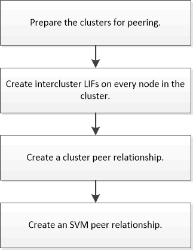

= Flux de travail de peering de cluster et de SVM
:allow-uri-read: 
:icons: font
:imagesdir: ../media/

[role="lead"]
Vous pouvez configurer une relation de peering en utilisant ONTAP System Manager avec ONTAP 9.7 ou version antérieure.
La configuration d'une relation de peering implique la préparation de chaque cluster pour le peering, la création d'interfaces logiques intercluster (LIF) sur chaque nœud de chaque cluster, la configuration d'une relation de cluster avec pairs, et la configuration d'une relation de SVM peering.

Si vous exécutez ONTAP 9.2 ou version antérieure, vous créez une relation de peering de SVM tout en créant une relation de protection des données entre le volume source et le volume de destination.
