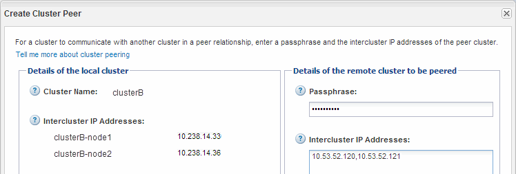

= Création d'une relation de cluster entre pairs (ONTAP 9.2 ou version antérieure)
:allow-uri-read: 
:icons: font
:imagesdir: ../media/

[role="lead"]
En utilisant l'interface ONTAP System Manager _Classic_ avec ONTAP 9.2 ou une version antérieure de ONTAP 9, vous pouvez créer une relation de cluster entre deux clusters en entrant une phrase secrète prédéfinie et les adresses IP des LIF intercluster du cluster distant. et vérifier ensuite que la relation a été créée avec succès.

.Avant de commencer
* Vous devez connaître les adresses IP de toutes les LIFs intercluster des clusters que vous souhaitez peer-to-peer.
* Vous devez connaître la phrase de passe que vous utiliserez pour chaque relation de pairs.

.Description de la tâche
Cette procédure doit être effectuée sur chaque cluster.

.Étapes
. Depuis le cluster source, créez une relation entre clusters et le cluster destination.
+
.. Cliquez sur l'onglet *configurations*.
.. Dans le volet *Paramètres du cluster*, cliquez sur *homologues du cluster*.
.. Cliquez sur *Créer*.
+
La boîte de dialogue *Créer un pair de cluster* s'affiche.

.. [[step1d-phrase-de-passe-utilisée]]dans la zone *Détails du cluster distant à péter*, spécifiez la phrase de passe que les deux pairs utiliseront pour assurer une relation de cluster authentifiée.
.. Entrer les adresses IP de l'ensemble des LIFs intercluster du cluster de destination (un par nœud) séparés par des virgules.
+
image::../media/cluster_peer_create.gif[Boîte de dialogue Créer un pair de cluster]

.. Cliquez sur *Créer*.
+
L'état d'authentification est « en attente » car un seul cluster a été configuré.

. Basculer vers le cluster de destination, puis créer une relation entre clusters et le cluster source :
+
.. Cliquez sur l'onglet *configurations*.
.. Dans le volet *Paramètres du cluster*, cliquez sur *homologues du cluster*.
.. Cliquez sur *Créer*.
+
La boîte de dialogue Créer un pair de cluster s'affiche.

.. Dans la zone *Détails du cluster distant à péter*, spécifiez la même phrase de passe que celle que vous avez spécifiée dans <<step1d-passphrase-used,Étape 1d>> Et les adresses IP des LIFs intercluster du cluster source, puis cliquez sur *Create*.

+

. Dans la fenêtre *Cluster pairs* du cluster de destination, confirmez que le cluster source est « disponible » et que l'état d'authentification est « OK ».
+
image::../media/cluster_peers_status.gif[Cette image est expliquée par le texte qui l'entoure.]

+
Vous devrez peut-être cliquer sur *Actualiser* pour afficher les informations mises à jour.

+
Les deux clusters sont dans une relation de pairs.

. Passez au cluster source et confirmez que le cluster de destination est « disponible » et que l'état d'authentification est « OK ».
+
Vous devrez peut-être cliquer sur *Actualiser* pour afficher les informations mises à jour.

== Que faire ensuite

Créer une relation SVM peer-to-peer entre les SVM source et destination tout en créant une relation de protection des données entre le volume source et le volume de destination.

link:../volume-backup-snapvault/index.html["Sauvegarde de volume avec SnapVault"]

link:../volume-disaster-recovery/index.html["Préparation de la reprise après incident de volume"]
