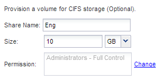

= Ajouter l'accès CIFS à un SVM existant
:allow-uri-read: 
:icons: font
:imagesdir: ../media/

[role="lead"]
L'ajout d'un accès CIFS/SMB à un SVM existant implique la création d'une LIF de données, la configuration d'un serveur CIFS, le provisionnement d'un volume, le partage du volume et la configuration des autorisations de partage.

.Avant de commencer
* Vous devez connaître les composants réseau suivants que la SVM utilisera :
+
** Le nœud et le port spécifique sur ce nœud où sera créée l'interface logique de données (LIF)
** Le sous-réseau à partir duquel l'adresse IP de la LIF de données sera provisionnée, ou éventuellement l'adresse IP spécifique que vous souhaitez attribuer à la LIF de données
** Le domaine Active Directory (AD) que ce SVM rejoindra, ainsi que les informations d'identification requises pour y ajouter le SVM

* Tout pare-feu externe doit être configuré de manière appropriée pour permettre l'accès aux services réseau.
* Le protocole CIFS doit être autorisé sur le SVM.
+
C'est le cas si vous n'avez pas créé le SVM après la procédure de configuration d'un protocole SAN.

.Étapes
. Naviguer sur la zone où vous pouvez configurer les protocoles du SVM :
+
.. Sélectionnez le SVM que vous souhaitez configurer.
.. Dans le volet *Détails*, en regard de *protocoles*, cliquez sur *CIFS*.
+
image::../media/svm_add_protocol_cifs.gif[Cette image est expliquée par le texte qui l'entoure.]

. Dans la section *Data LIF Configuration* de la boîte de dialogue *Configure CIFS Protocol*, créer une LIF de données pour la SVM :
+
.. Attribuez automatiquement une adresse IP à la LIF à partir d'un sous-réseau que vous spécifiez ou saisissez manuellement l'adresse.
.. Cliquez sur *Browse* et sélectionnez un nœud et un port qui seront associés à la LIF.
+
image::../media/svm_setup_cifs_nfs_page_lif_multi_nas_smb.gif[Ce graphique est décrit par le texte environnant.]

. Dans la section *CIFS Server Configuration*, définissez le serveur CIFS et configurez-le pour accéder au domaine AD :
+
.. Spécifiez un nom pour le serveur CIFS unique dans le domaine AD.
.. Spécifiez le FQDN du domaine AD auquel le serveur CIFS peut se joindre.
.. Si vous souhaitez associer une unité organisationnelle (ou) au sein du domaine AD autre que CN=Computers, entrez l'UO.
.. Spécifiez le nom et le mot de passe d'un compte administratif disposant de privilèges suffisants pour ajouter le serveur CIFS à l'UO.
.. Si vous souhaitez éviter tout accès non autorisé à tous les partages de ce SVM, sélectionner l'option de chiffrement des données à l'aide de SMB 3.0.

+
image::../media/svm_setup_cifs_nfs_page_cifs_ad_smb.gif[Ce graphique est décrit par le texte environnant.]

. Créer un volume pour l'accès CIFS/SMB et provisionner un partage sur celui-ci :
+
.. Nommez le partage que les clients CIFS/SMB utiliseront pour accéder au volume.
+
Le nom que vous saisissez pour le partage sera également utilisé comme nom de volume.

.. Spécifiez une taille pour le volume.
+

+
Il n'est pas nécessaire de préciser l'agrégat du volume, car il est automatiquement situé sur l'agrégat disposant de l'espace le plus disponible.

. *Facultatif* : limitez l'accès au partage en modifiant la liste de contrôle d'accès du partage :
+
.. Dans le champ *permission*, cliquez sur *Modifier*.
.. Sélectionnez le groupe tout le monde, puis cliquez sur *Supprimer*.
.. *Facultatif* : cliquez sur *Ajouter*, puis entrez le nom d'un groupe d'administrateurs défini dans le domaine Windows Active Directory qui inclut le SVM.
.. Sélectionnez le nouveau groupe d'administrateurs, puis *contrôle complet*.
.. Cliquez sur *Enregistrer et fermer*.

. Cliquez sur *Envoyer et fermer*, puis sur *OK*.

