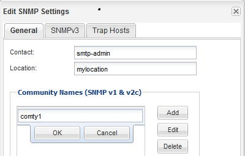

= Ajouter une communauté SNMP
:allow-uri-read: 
:icons: font
:imagesdir: ../media/

[role="lead"]
Vous pouvez utiliser l'interface ONTAP System Manager _Classic_ avec ONTAP 9.7 ou version antérieure pour ajouter une communauté au SVM (administrative Storage Virtual machine) pour un cluster qui exécute SNMPv1 ou SNMPv2c. System Manager utilise les protocoles SNMP SNMPv1 et SNMPv2c, et une communauté SNMP pour détecter les systèmes de stockage.

.Description de la tâche
Cette procédure permet d'ajouter une communauté SNMP au SVM d'administration du cluster. La procédure pour ajouter une communauté SNMP à un SVM de données est décrite dans le https://docs.netapp.com/us-en/ontap/networking/index.html["Gestion du réseau"].

Dans les nouvelles installations de ONTAP, SNMPv1 et SNMPv2c sont désactivés par défaut. Les protocoles SNMPv1 et SNMPv2c sont activés lorsque vous créez une communauté SNMP.

.Étapes
. Dans la fenêtre SNMP, cliquez sur *Modifier* pour ouvrir la boîte de dialogue *Modifier les paramètres SNMP*.
. Dans l'onglet *général*, indiquez le personnel de contact et l'emplacement du système ONTAP.
. Cliquez sur *Ajouter*, entrez un nom de communauté, puis cliquez sur *OK* dans le volet *noms de communauté*.
+
Vous pouvez ajouter plusieurs noms de communauté. Un nom de communauté peut comporter un maximum de 32 caractères et ne doit pas contenir les caractères spéciaux suivants : `, / : " ' |`

+

. Lorsque vous avez terminé d'ajouter des noms de communauté, cliquez sur *OK* dans la boîte de dialogue *Modifier les paramètres SNMP*.

