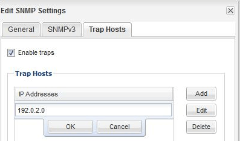

= Ajouter un Traphost SNMP
:allow-uri-read: 
:icons: font
:imagesdir: ../media/

[role="lead"]
Vous pouvez utiliser l'interface _classic_ du Gestionnaire système ONTAP avec ONTAP 9.7 ou une version antérieure pour ajouter un traphost (gestionnaire SNMP) afin de recevoir des notifications SNMP (unités de données du protocole de trap SNMP) lorsque des traps sont générés dans le cluster.

.Avant de commencer
IPv6 doit être activé sur le cluster si vous configurez des Traphosts SNMP possédant des adresses IPv6.

.Description de la tâche
Les interruptions SNMP et SNMP sont activées par défaut. Le rapport technique NetApp TR-4220 sur la prise en charge de SNMP contient la liste de tous les événements par défaut qui sont pris en charge par les traps SNMP.

http://www.netapp.com/us/media/tr-4220.pdf["Rapport technique NetApp 4220 : prise en charge SNMP dans Data ONTAP"^]

.Étapes
. Dans la fenêtre SNMP, cliquez sur *EDIT* pour ouvrir la boîte de dialogue *Edit SNMP Settings*.
. [[step2-verify-enable-traps]]dans l'onglet *Trap hosts*, vérifiez que la case *Enable traps* est cochée et cliquez sur *Add*.
. [[step3-ENTER-traphost-ip]]Entrez l'adresse IP de traphost, puis cliquez sur *OK* dans le volet *Trap hosts*.
+
L'adresse IP d'un Traphost SNMP peut être IPv4 ou IPv6.

+

. Pour ajouter un autre Traphost, répétez l'opération <<step2-verify-enable-traps,Étape 2>> et <<step3-enter-traphost-ip,Étape 3>>.
. Lorsque vous avez terminé d'ajouter des Traphosts, cliquez sur *OK* dans la boîte de dialogue *Modifier les paramètres SNMP*.

