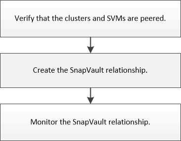

= Workflow de configuration de sauvegarde SnapVault
:allow-uri-read: 
:icons: font
:imagesdir: ../media/

[role="lead"]
La configuration d'une relation de sauvegarde SnapVault comprend la vérification de la relation entre clusters, la création de la relation SnapVault entre les volumes source et de destination, ainsi que le contrôle de la relation SnapVault.

Une documentation supplémentaire est disponible pour vous aider à restaurer les données d'un volume de destination pour tester les données sauvegardées ou en cas de perte du volume source.

* xref:../volume-restore-snapvault/index.html[Gestion des restaurations de volumes avec SnapVault]
+
Décrit la restauration rapide d'un volume à partir d'une sauvegarde SnapVault dans ONTAP

