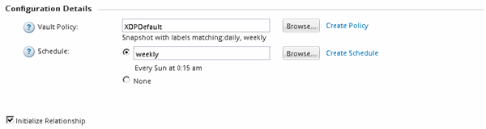
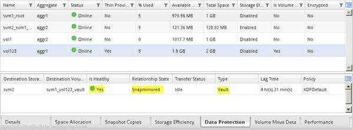

= Création de la relation SnapVault (ONTAP 9.2 ou version antérieure)
:allow-uri-read: 
:icons: font
:imagesdir: ../media/

[role="lead"]
Vous devez créer une relation SnapVault entre le volume source sur un cluster et le volume de destination sur le cluster peering pour créer une sauvegarde SnapVault.

.Avant de commencer
* Vous devez disposer du nom d'utilisateur et du mot de passe de l'administrateur du cluster pour le cluster de destination.
* L'agrégat de destination doit disposer d'espace disponible.

.Description de la tâche
Vous devez effectuer cette tâche à partir du cluster *source*.

.Étapes
. Cliquez sur *Storage* > *SVM*.
. Sélectionner la SVM, puis cliquer sur *SVM Settings*.
. Cliquez sur l'onglet *volumes*.
. Sélectionnez le volume à sauvegarder, puis cliquez sur *protéger*.
. Dans la boîte de dialogue *Créer une relation de protection*, sélectionnez *coffre-fort* dans la liste déroulante *Type de relation*.
. Dans la section *Volume de destination*, sélectionnez le cluster de peering.
. Spécifier le SVM pour le volume de destination :
+
|===
| Si la SVM est... | Alors... 

 a| 
Pételé
 a| 
Sélectionner le SVM de peering dans la liste.

 a| 
Non pételé
 a| 
.. Sélectionner le SVM.
.. Cliquez sur *authentifier*.
.. Entrez les informations d'identification de l'administrateur de cluster pour le cluster avec groupe de connexion, puis cliquez sur *Créer*.

|===
. Créer un nouveau volume de destination :
+
.. Sélectionnez l'option *Nouveau volume*.
.. Utilisez le nom de volume par défaut ou entrez un nouveau nom de volume.
.. Sélectionner l'agrégat de destination
.. Assurez-vous que la case *Activer la déduplication* est cochée.

+
image::../media/dest_vol_snapvault.gif[dest vol SnapVault]

. Dans la section *Détails de la configuration*, sélectionnez `XDPDefault` comme la politique de protection.
. Sélectionnez un planning de protection dans la liste des planifications.
. Assurez-vous que la case *Initialize Relationship* est cochée pour transférer la copie Snapshot de base, puis cliquez sur *Create*
+

+
L'assistant crée la relation avec la stratégie de coffre-fort et la planification spécifiées. La relation est initialisée en démarrant un transfert de base des données du volume source vers le volume de destination.

+
La section État indique l'état de chaque travail.

+
image::../media/create_snapvault_success.gif[créez SnapVault]

. Vérifier que l'état de la relation SnapVault se trouve dans le `Snapmirrored` état.
+
.. Sélectionnez le volume dans la liste volumes, puis cliquez sur *Data protection*.
.. Dans l'onglet du bas *Data protection*, vérifiez que la relation SnapMirror que vous avez créée est répertoriée et que l'état de la relation est `Snapmirrored` et le type est `Vault`.
+

