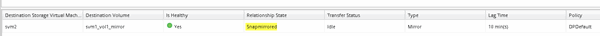

= Création de la relation SnapMirror (ONTAP 9.2 ou version antérieure)
:allow-uri-read: 
:icons: font
:imagesdir: ../media/

[role="lead"]
Vous devez créer une relation SnapMirror entre le volume source sur un cluster et le volume de destination sur le cluster en peering pour la réplication des données en vue de la reprise sur incident.

.Avant de commencer
* Vous devez disposer du nom d'utilisateur et du mot de passe de l'administrateur du cluster pour le cluster de destination.
* L'agrégat de destination doit disposer d'espace disponible.
* Les deux clusters doivent être configurés et configurés de manière appropriée pour répondre aux exigences de l'environnement en termes d'accès utilisateur, d'authentification et d'accès client.

.Description de la tâche
Vous devez effectuer cette tâche à partir du cluster *source*.

.Étapes
. Cliquez sur *Storage* > *SVM*.
. Sélectionner la SVM, puis cliquer sur *SVM Settings*.
. Cliquez sur l'onglet *volumes*.
. Sélectionnez le volume pour lequel vous souhaitez créer une relation miroir, puis cliquez sur *protéger*.
+
La fenêtre Créer une relation de protection s'affiche.

. Dans la section *Type de relation*, sélectionnez *miroir* dans la liste déroulante *Type de relation*.
. Dans la section *Volume de destination*, sélectionnez le cluster de peering.
. Spécifier le SVM pour le volume de destination :
+
|===
| Si la SVM est... | Alors... 

 a| 
Pételé
 a| 
Sélectionner le SVM de peering dans la liste.

 a| 
Non pételé
 a| 
.. Sélectionner le SVM.
.. Cliquez sur *authentifier*.
.. Entrez les informations d'identification de l'administrateur de cluster pour le cluster avec groupe de connexion, puis cliquez sur *Créer*.

|===
. Créer un nouveau volume de destination :
+
.. Sélectionnez l'option *Nouveau volume*.
.. Utilisez le nom de volume par défaut ou spécifiez un nouveau nom de volume.
.. Sélectionner l'agrégat de destination

+
image::../media/destination_volume_settings.gif[Paramètres du volume de destination]

. Dans la section *Détails de la configuration*, sélectionnez *MirrorAllsnapshots* comme stratégie de miroir.
+
`DPDefault` et `MirrorLatest` Les autres règles de miroir par défaut sont disponibles pour les relations SnapMirror.

. Sélectionnez un planning de protection dans la liste des planifications.
. Assurez-vous que la case *Initialize Relationship* est cochée, puis cliquez sur *Create*.
+
L'initialisation de la relation SnapMirror garantit que le volume de destination dispose d'une base pour commencer à protéger le volume source.

+
image::../media/create_snapmirror_relationship_window.gif[Créer la fenêtre SnapMirror]

+
La relation est initialisée en démarrant un transfert de base des données du volume source vers le volume de destination.

+
L'opération d'initialisation peut prendre un certain temps. La section État indique l'état de chaque travail.

+
image::../media/snapmirror_create_3_successful.gif[Création de SnapMirror réussie]

. Vérifier l'état de la relation avec SnapMirror :
+
.. Sélectionnez le volume pour lequel vous avez créé la relation SnapMirror dans la liste *volumes*, puis cliquez sur *Data protection*.
.. Dans l'onglet *Data protection*, vérifiez que la relation SnapMirror que vous avez créée est répertoriée et que l'état de la relation est `Snapmirrored`.
+

== Que faire ensuite

Vous devez noter les paramètres définis pour le volume source, tels que le provisionnement fin, la déduplication, la compression et la croissance automatique. Vous pouvez utiliser ces données pour vérifier les paramètres du volume de destination lorsque vous rompez la relation SnapMirror.
