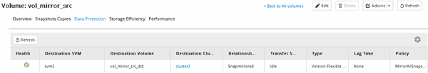

= Création de la relation SnapMirror (à partir de ONTAP 9.3)
:allow-uri-read: 
:icons: font
:imagesdir: ../media/

[role="lead"]
Vous devez créer une relation SnapMirror entre le volume source sur un cluster et le volume de destination sur le cluster en peering pour la réplication des données en vue de la reprise sur incident.

.Avant de commencer
* L'agrégat de destination doit disposer d'espace disponible.
* Les deux clusters doivent être configurés et configurés de manière appropriée pour répondre aux exigences de l'environnement en termes d'accès utilisateur, d'authentification et d'accès client.

.Description de la tâche
Vous devez effectuer cette tâche à partir du cluster *source*.

.Étapes
. Cliquez sur *Storage* > *volumes*.
. Sélectionnez le volume pour lequel vous souhaitez créer une relation miroir, puis cliquez sur *actions* > *protéger*.
. Dans la section *Type de relation*, sélectionnez *miroir* dans la liste déroulante *Type de relation*.
. Dans la page *volumes: Protect volumes*, fournissez les informations suivantes :
+
.. Sélectionnez *miroir* comme type de relation.
.. Sélectionner le cluster de destination, le SVM de destination et le suffixe correspondant au nom du volume de destination.
+
Seuls les SVM peering et les SVM autorisés sont répertoriés sous les SVM de destination.

.. Cliquez sur image:../media/advanced_options_icon_disaster.gif["Icône Options avancées"].
.. Dans la boîte de dialogue *Options avancées*, vérifiez cela `MirrorAllSnapshots` est définie comme règle de protection.
+
`DPDefault` et `MirrorLatest` Les autres règles de protection par défaut sont disponibles pour les relations SnapMirror.

.. Sélectionnez un planning de protection.
+
Par défaut, le `hourly` la planification est sélectionnée.

.. Vérifiez que *Oui* est sélectionné pour initialiser la relation SnapVault.
+
Toutes les relations de protection des données sont initialisées par défaut. L'initialisation de la relation SnapMirror garantit que le volume de destination dispose d'une base pour commencer à protéger le volume source.

.. Cliquez sur *appliquer* pour enregistrer les modifications.
+
image::../media/snapmirror_advanced_options_93.gif[Options avancées]

. Cliquez sur *Save* pour créer la relation SnapMirror.
. Vérifier que l'état de la relation SnapMirror est dans le `Snapmirrored` état.
+
.. Accédez à la fenêtre *volumes*, puis sélectionnez le volume pour lequel vous avez créé la relation SnapMirror.
.. Double-cliquez sur le volume pour afficher les détails du volume, puis cliquez sur *PROTECTION* pour afficher l'état de protection des données du volume.

+

== Que faire ensuite

Vous devez noter les paramètres définis pour le volume source, tels que le provisionnement fin, la déduplication, la compression et la croissance automatique. Vous pouvez utiliser ces données pour vérifier les paramètres du volume de destination lorsque vous rompez la relation SnapMirror.
