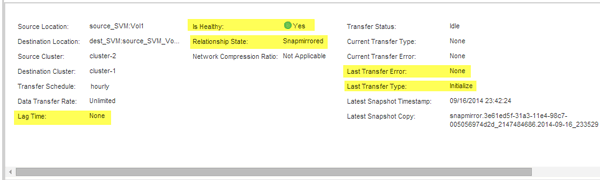

= Surveiller l'état des transferts de données SnapMirror
:allow-uri-read: 
:icons: font
:imagesdir: ../media/

[role="lead"]
Vous devez régulièrement surveiller l'état des relations SnapMirror pour vous assurer que les transferts de données SnapMirror sont effectués conformément au planning spécifié.

.Description de la tâche
Vous devez effectuer cette tâche à partir du cluster *destination*.

.Étapes
. Selon la version de System Manager que vous exécutez, effectuez l'une des opérations suivantes :
+
** ONTAP 9.4 ou version antérieure : cliquez sur *protection* > *relations*.
** À partir de ONTAP 9.5 : cliquez sur *protection* > *relations de volume*.

. Sélectionnez la relation SnapMirror entre les volumes source et de destination, puis vérifiez l'état dans l'onglet *Détails* inférieur.
+
L'onglet Détails affiche l'état de santé de la relation SnapMirror et affiche les erreurs de transfert et le délai d'attente.

+
** Le champ est sain doit s'afficher `Yes`.
+
Pour la plupart des échecs de transfert de données SnapMirror, le champ s'affiche `No`. Toutefois, dans certains cas de défaillance, le champ continue à s'afficher `Yes`. Vous devez vérifier les erreurs de transfert dans la section Détails pour vous assurer qu'aucun échec de transfert de données ne s'est produit.

** Le champ État de la relation doit s'afficher `Snapmirrored`.
** Le temps de décalage ne doit pas dépasser l'intervalle de planification de transfert.
+
Par exemple, si la planification de transfert est horaire, la durée de décalage ne doit pas dépasser une heure.

+
Vous devez résoudre tous les problèmes liés aux relations SnapMirror.

+
http://www.netapp.com/us/media/tr-4015.pdf["Rapport technique NetApp 4015 : configuration de SnapMirror et meilleures pratiques pour ONTAP 9.1, 9.2"^]

+

