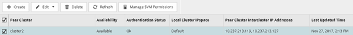

= Vérifier la relation entre clusters et la relation entre SVM
:allow-uri-read: 
:icons: font
:imagesdir: ../media/

[role="lead"]
Avant de configurer un volume pour la reprise sur incident, vérifiez que les clusters source et de destination communiquent entre eux via la relation entre pairs.

== Procédure

* Si vous exécutez ONTAP 9.3 ou une version ultérieure, effectuez les opérations suivantes pour vérifier la relation entre clusters et SVM peer :
+
.. Cliquez sur *Configuration* > *Cluster pairs*.
.. Vérifier que le cluster de peering est authentifié et disponible.
+

.. Cliquez sur *Configuration* > *SVM pairs*.
.. Vérifier que le SVM de destination est peering avec le SVM source.

* Si vous exécutez ONTAP 9.2 ou une version antérieure, effectuez les opérations suivantes pour vérifier la relation entre clusters et SVM peer :
+
.. Cliquez sur l'onglet *configurations*.
.. Dans le volet *Détails du cluster*, cliquez sur *homologues du cluster*.
.. Vérifier que le cluster de peering est authentifié et disponible.
+
image::../media/cluster_peer_health_disaster.gif[incident de santé des pairs de cluster]

.. Cliquer sur l'onglet *SVM* et sélectionner le SVM source.
.. Dans la zone *Peer Storage Virtual machines*, vérifiez que le SVM de destination est associé au SVM source.
+
Si vous ne voyez pas de SVM peering dans ce domaine, vous pouvez créer la relation de SVM peer-to-peer en créant la relation SnapMirror.

+
xref:task_creating_snapmirror_relationships_92_earlier.adoc[Création de la relation SnapMirror (ONTAP 9.2 ou version antérieure)]

