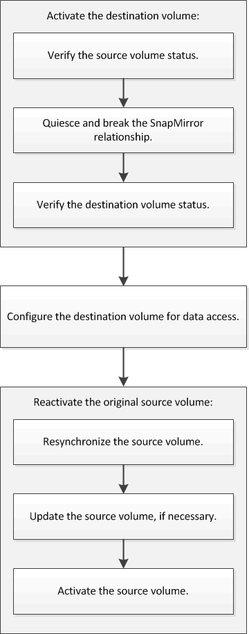

= Flux de travail de reprise après incident de volume
:allow-uri-read: 
:icons: font
:imagesdir: ../media/

[role="lead"]
Le workflow de reprise après incident de volume comprend l'activation du volume de destination, la configuration du volume de destination pour l'accès aux données et la réactivation du volume source d'origine.

Des informations supplémentaires sont disponibles pour vous aider à gérer les relations de reprise après incident au niveau des volumes, et vous propose d'autres méthodes de reprise après incident afin de protéger la disponibilité de vos ressources de données.

* xref:../volume-backup-snapvault/index.html[Sauvegarde de volume avec SnapVault]
+
Décrit comment configurer rapidement les relations de copie à distance de sauvegarde entre les volumes situés dans différents clusters ONTAP.

* xref:../volume-restore-snapvault/index.html[Gestion des restaurations de volumes avec SnapVault]
+
Décrit comment restaurer rapidement un volume à partir d'un coffre-fort de sauvegarde dans ONTAP.

