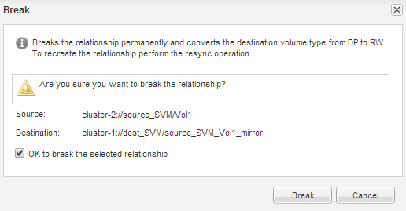

= Interrompre la relation SnapMirror
:allow-uri-read: 
:icons: font
:imagesdir: ../media/

[role="lead"]
Vous devez arrêter et interrompre la relation SnapMirror pour activer le volume de destination. Après la suspension, les futurs transferts de données SnapMirror sont désactivés.

.Avant de commencer
Le volume de destination doit être monté sur le namespace du SVM de destination.

.Description de la tâche
Vous devez effectuer cette tâche à partir du cluster *destination*.

.Étapes
. Selon la version de System Manager que vous exécutez, effectuez l'une des opérations suivantes :
+
** ONTAP 9.4 ou version antérieure : cliquez sur *protection* > *relations*.
** À partir de ONTAP 9.5 : cliquez sur *protection* > *relations de volume*.

. Sélectionner la relation SnapMirror entre les volumes source et de destination
. Cliquez sur *Operations* > *Quiesce* pour désactiver les futurs transferts de données.
. Cochez la case de confirmation, puis cliquez sur *Quiesce*.
+
L'opération de mise en veille peut prendre du temps. Vous ne devez pas effectuer d'autres opérations sur la relation SnapMirror tant que l'état du transfert n'est pas affiché comme `Quiesced`.

. Cliquez sur *Operations* > *Break*.
. Cochez la case de confirmation, puis cliquez sur *Break*.
+

+
La relation SnapMirror est en `Broken Off` état.

+
image::../media/break_verify.gif[Relation SnapMirror à l'état Broken-off]

