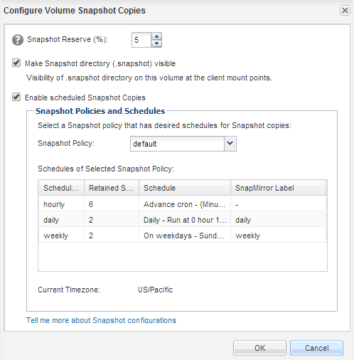

= Vérifiez l'état du volume de destination
:allow-uri-read: 
:icons: font
:imagesdir: ../media/

[role="lead"]
Une fois la relation SnapMirror rompant, vous devez vérifier que le volume de destination dispose d'un accès en lecture/écriture et que les paramètres du volume de destination correspondent aux paramètres du volume source.

.Description de la tâche
Vous devez effectuer cette tâche à partir du cluster *destination*.

.Étapes
. Accédez à la fenêtre *volumes*.
. Sélectionnez le volume de destination dans la liste *volumes*, puis vérifiez que le type de volume de destination est `rw`, qui indique l'accès en lecture/écriture.
. Vérifiez que les paramètres du volume, tels que le provisionnement fin, la déduplication, la compression et la croissance automatique sur le volume de destination correspondent aux paramètres du volume source.
+
Vous pouvez utiliser les informations sur les paramètres de volume que vous avez indiquées après la création de la relation SnapMirror pour vérifier les paramètres du volume de destination.

. Si les paramètres de volume ne correspondent pas, modifiez les paramètres du volume de destination comme requis :
+
.. Cliquez sur *Modifier*.
.. Modifiez les paramètres généraux, les paramètres d'efficacité du stockage et les paramètres avancés de votre environnement, selon les besoins.
.. Cliquez sur *Enregistrer et fermer*.
+
image::../media/volume_edit_dest_vol_unix.gif[Capture d'écran de la boîte de dialogue Modifier le volume.]

.. Vérifiez que les colonnes de la liste *volumes* sont mises à jour avec les valeurs appropriées.

. Activez la création de copie Snapshot pour le volume de destination.
+
.. En fonction de votre version ONTAP, accédez à la page *configurer les copies Snapshot de volume* de l'une des manières suivantes :
+
En commençant par ONTAP 9.3 : sélectionnez le volume de destination, puis cliquez sur *actions* > *gérer les instantanés* > *configurer*.

+
ONTAP 9.2 ou version antérieure : sélectionnez le volume de destination, puis cliquez sur *copies Snapshot* > *configurer*.

.. Cochez la case *Activer les copies Snapshot planifiées*, puis cliquez sur *OK*.

+

