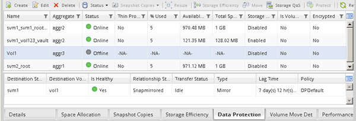

= Vérifiez l'état du volume source
:allow-uri-read: 
:icons: font
:imagesdir: ../media/

[role="lead"]
Lorsque le volume source n'est plus disponible, vous devez vérifier que le volume source est hors ligne, puis identifier le volume de destination à activer pour permettre l'accès aux données.

.Description de la tâche
Vous devez effectuer cette tâche à partir du cluster *source*.

.Étapes
. Accédez à la fenêtre *volumes*.
. Sélectionnez le volume source, puis vérifiez que le volume source est hors ligne.
. Identifier le volume de destination dans la relation SnapMirror
+
** Depuis ONTAP 9.3 : double-cliquez sur le volume source pour afficher les détails, puis sur *PROTECTION* pour identifier le volume de destination dans la relation SnapMirror et le nom de la SVM qui contient le volume.
+
image::../media/snapmirror_destination_93.gif[destination snapmirror 93]

** ONTAP 9.2 ou version antérieure : cliquez sur l'onglet *Data protection* en bas de la page volumes pour identifier le volume de destination dans la relation SnapMirror et le nom du SVM qui contient le volume.
+

