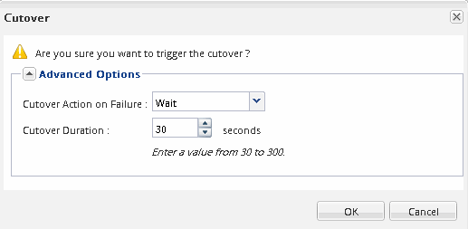

= Déplacer un volume à l'aide de System Manager
:allow-uri-read: 
:icons: font
:imagesdir: ../media/

[role="lead"]
À l'aide de l'interface System Manager _Classic_ de ONTAP avec ONTAP 9.7 ou une version antérieure, vous pouvez déplacer un volume en sélectionnant un volume et l'agrégat de destination, démarrer l'opération de déplacement de volume et, éventuellement, contrôler la tâche de déplacement de volume. Avec System Manager, une opération de déplacement de volume se termine automatiquement.

.Avant de commencer
Vous devez avoir vérifié l'espace disponible sur l'agrégat source et l'agrégat de destination avant l'opération de déplacement de volume et après l'opération de déplacement de volume.

.Description de la tâche
Une opération de déplacement de volume n'est prise en charge qu'au sein d'un même cluster. Notez également que l'agrégat que vous déplacez le volume vers et l'agrégat que vous déplacez doivent se trouver sur le même SVM (Storage Virtual machine). Un déplacement de volume n'interrompt pas l'accès client.

.Étapes
. Accédez à la fenêtre *volumes*.
. Sélectionnez le volume à déplacer, puis cliquez sur *actions* > *déplacer*.
. Sélectionner l'agrégat de destination, puis démarrer l'opération de déplacement de volume :
+
.. Sélectionnez un agrégat de destination dans la liste des agrégats possibles, qui inclut uniquement les agrégats disposant de la capacité requise.
+
Il est recommandé de vérifier l'espace disponible, l'espace total, le type RAID et le type de stockage des agrégats. Par exemple, si l'objectif est de modifier les caractéristiques de performance du volume, vous pouvez vous concentrer sur les agrégats disposant du type de stockage souhaité.

.. Cliquez sur *déplacer*, puis cliquez à nouveau sur *déplacer* pour confirmer que vous souhaitez poursuivre l'opération de déplacement de volume.
+
Lorsque la boîte de dialogue déplacer le volume s'affiche, laissez la boîte de dialogue ouverte si vous souhaitez surveiller le travail de déplacement de volume.

. *Facultatif:* [[step4-Monitor]]surveillez le travail de déplacement de volume :
+
.. Dans la boîte de dialogue *déplacer volume*, cliquez sur le lien vers *ID travail* du travail de déplacement de volume.
.. Localisez le travail de déplacement de volume, puis examinez les informations dans la colonne *État*.
+
Cette tâche peut se trouver dans l'une ou l'autre des phases, telles que le transfert de la base de données initiale ou le démarrage d'une tentative de mise en service.

+
image::../media/volume_move_3_job_cutover.gif[Cette image est expliquée par le texte qui l'entoure.]

.. Cliquez sur *Actualiser* dans la fenêtre *Jobs* pour afficher l'état du travail mis à jour.
+
image::../media/volume_move_4_job_is_successful.gif[Cette image est expliquée par le texte qui l'entoure.]

+
Le statut du travail devient `Complete: Successful` une fois l'opération de déplacement de volume terminée.

. Si le déplacement de volume entre dans la phase d'ajournement de la mise en service, effectuez une mise en service manuelle.
+
.. Dans la fenêtre *volumes*, sélectionnez le volume pour lequel vous avez lancé le travail de déplacement de volume.
.. Lancement de la mise en service pour le volume :
+
|===

| Si vous exécutez... | Procédez comme suit... 

 a| 
ONTAP 9.3 ou version ultérieure
 a| 
... Développez le volume et cliquez sur le lien *Afficher plus de détails* pour afficher plus d'informations sur le volume.
... Dans l'onglet *Présentation*, cliquez sur *mise en service*.

 a| 
ONTAP 9.2 ou version antérieure
 a| 
Dans l'onglet *Détails du déplacement de volume*, cliquez sur *mise en service*.

|===
.. Dans la boîte de dialogue *mise en service* , cliquez sur *Options avancées* .
.. Spécifiez l'action de mise en service et la durée de la mise en service.
+

.. Cliquez sur *OK*.

. Recommencez <<step4-monitor,Étape 4>>.

