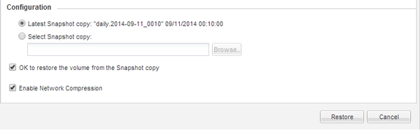

= Restaurez les données à partir d'une sauvegarde SnapVault
:allow-uri-read: 
:icons: font
:imagesdir: ../media/

[role="lead"]
Après avoir sélectionné le volume de destination de la sauvegarde SnapVault, vous devez effectuer l'opération de restauration soit sur un nouveau volume pour tester les données sauvegardées, soit sur un volume existant pour restaurer les données perdues ou corrompues.

.Description de la tâche
Vous devez effectuer cette tâche à partir du cluster *destination*.

.Étapes
. Selon la version de System Manager que vous exécutez, effectuez l'une des opérations suivantes :
+
** ONTAP 9.4 ou version antérieure : cliquez sur *protection* > *relations*.
** À partir de ONTAP 9.5 : cliquez sur *protection* > *relations de volume*.

. Sélectionner le SVM qui contient le volume de destination de sauvegarde SnapVault, puis cliquer sur *Operations* > *Restore*.
. Dans la boîte de dialogue *Restore*, restaurez les données sur le volume source d'origine ou sur un nouveau volume :
+
|===
| Si vous voulez restaurer... | Alors... 

 a| 
Volume source d'origine
 a| 
Sélectionnez *Volume source*.

 a| 
Un nouveau volume
 a| 
.. Sélectionnez *autre volume*.
.. Sélectionner le cluster peering et le SVM peering pour le volume.
.. Sélectionnez un SVM peering dans la liste.
.. Si le SVM n'est pas peering, créer la relation entre SVM et :
+
... Sélectionner le SVM.
... Cliquez sur *authentifier*.
... Entrez les informations d'identification de l'administrateur de cluster pour le cluster avec groupe de connexion, puis cliquez sur *Créer*.

.. Sélectionnez *Nouveau volume*.
.. Si vous souhaitez modifier le nom par défaut, affiché dans le format `destination_SVM_name_destination_volume_name_restore`, spécifiez un nouveau nom et sélectionnez l'agrégat contenant pour le volume.
.. Cochez la case *Activer la déduplication*.

|===
+
image:../media/restore_to.gif["Sélection du volume à restaurer"]

. Sélectionnez la dernière copie Snapshot ou une copie Snapshot spécifique que vous souhaitez restaurer.
. Cochez la case *OK pour restaurer le volume à partir de la copie snapshot*.
. Cochez la case *Activer la compression réseau* pour compresser les données transférées pendant l'opération de restauration.
. Cliquez sur *Restaurer*.
+
Pendant le processus de restauration, le volume en cours de restauration est modifié en lecture seule. Une fois l'opération de restauration terminée, la relation temporaire est supprimée et le volume restauré devient lecture/écriture.

+

. Cliquez sur *OK* dans la zone de message.

